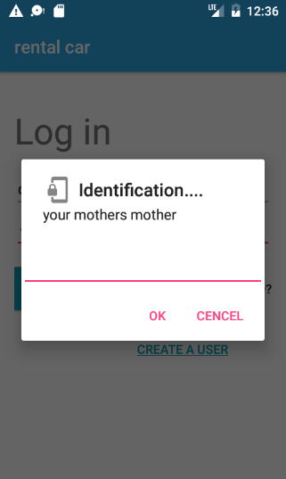
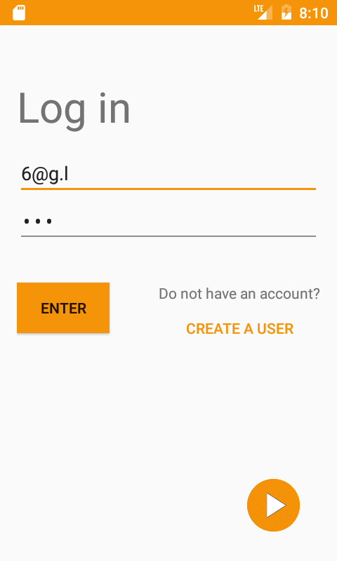
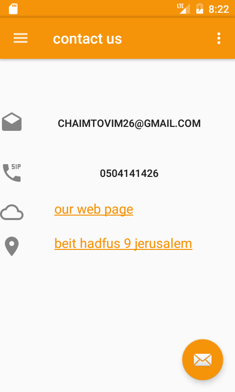

## Rental car application

management rental car, client and server application.
	
#server application:
* store cars, branch and users data.
* management their user rental, user payment and the cars.
			
#client application:
* login to the company
* search branch in the nearest location
* payment when finish ti use.
		
## screen shot

*server application:
	
	
	
	
	
	
*client application:
	
	
	
	
	
	
	
	

	

	
	
	
	